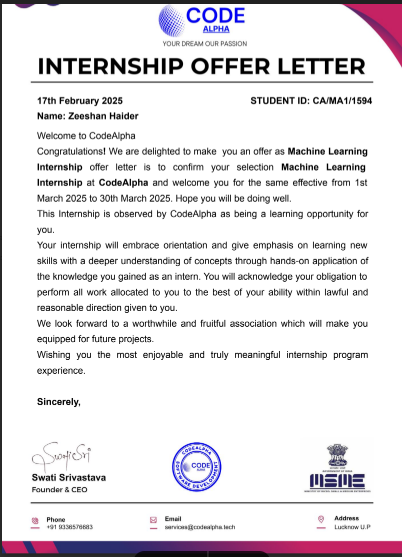

# Machine Learning Internship Projects

Welcome to my Machine Learning Internship Projects repository! This repository contains the projects I completed during my internship. Below, you'll find details about the internship, the tasks I worked on, and the skills I gained.

---

## Internship Offer Letter

Below is my internship offer letter from **CodeAlpha**:

  

---

## Tasks Completed

During my internship, I worked on the following tasks:

1. **Credit Scoring Model**  
   - Developed a machine learning model to predict credit scores based on customer data.  
   - Techniques used: Data preprocessing, feature engineering, and model evaluation.  

2. **Emotion Recognition from Speech**  
   - Built a model to recognize emotions from audio speech data.  
   - Techniques used: Audio signal processing, feature extraction, and classification algorithms.  

3. **Disease Prediction from Medical Data**  
   - Created a predictive model to identify diseases based on medical datasets.  
   - Techniques used: Data analysis, feature selection, and machine learning algorithms.  

---

## Inspiration and Resources

The projects in this repository were inspired by various open-source machine learning projects and datasets available online. I would like to acknowledge the contributions of the machine learning community, which helped me learn and implement these projects effectively.  

---


## How to Use This Repository

1. Clone the repository:
   ```bash
   git clone https://github.com/habibkhan099/Machine-Learning-Internship-Projects.git

2. Navigate to the project folder you're interested in:
    ```bash
    cd Machine-Learning-Internship-Projects/Credit-Scoring-Model
3. Follow the instructions in the respective project's README file to run the code.


## License
This project is licensed under the GNU General Public **License v3.0**. See the LICENSE file for details.

Thank you for visiting my repository! If you have any questions or feedback, feel free to reach out.
